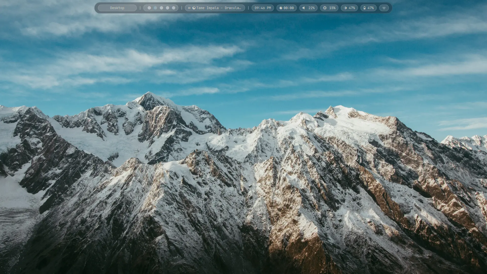
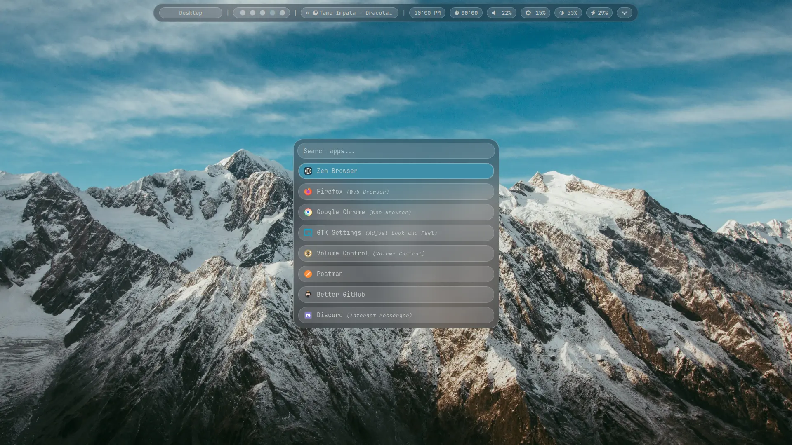
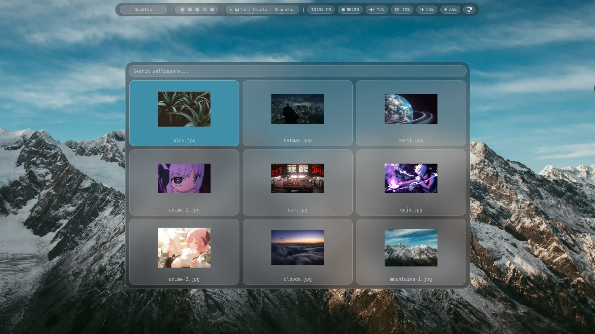
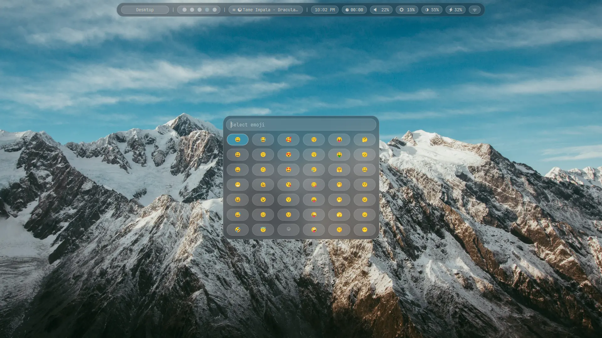
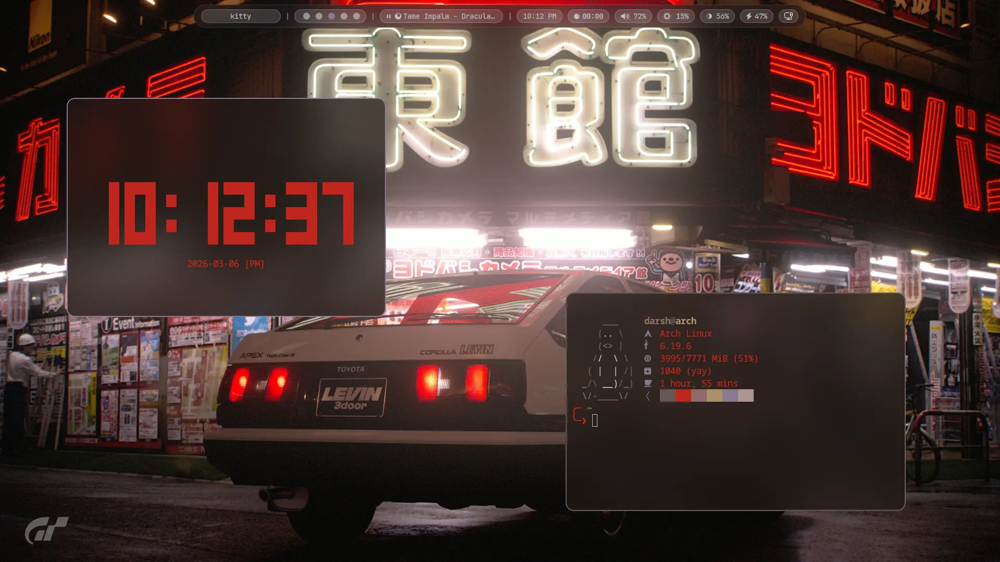
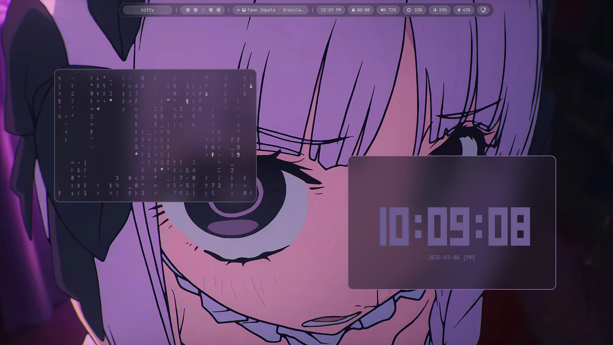
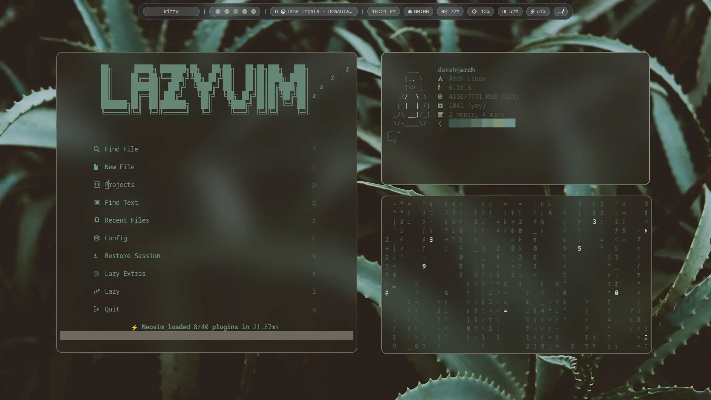
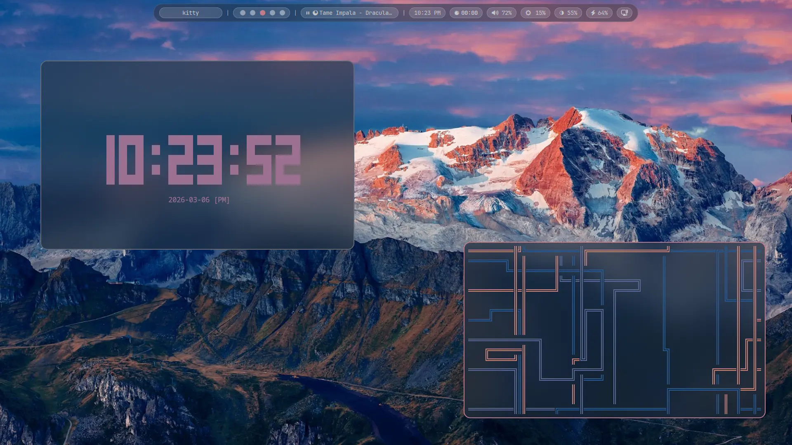

<p align="center">
  
</p>

<p align="center">
  
</p>
<p align="center">
</p>

### Rofi
>
> App Launcher, Wallpaper Switcher, Clipboard History, Emoji Picker.
<p align="center">
  
  
</p>
<p align="center">
  
  
</p>

### Theme Palette
>
> Theme colors are generated from the active wallpaper using `pywal`.
<p align="center">
  
  
</p>
<p align="center">
  
  
</p>

## Installation

quick setup:

```bash
bash <(curl -fsSL https://raw.githubusercontent.com/d1rshan/dots/main/setup.sh)
```

manual steps:

1. Install prerequisites (Arch):

```bash
sudo pacman -S --needed hyprland hyprpaper hyprlock hypridle hyprshot waybar rofi kitty fish neovim mako fastfetch starship wl-clipboard
yay -S python-pywal16
sudo pacman -S --needed ttf-jetbrains-mono-nerd ttf-font-awesome noto-fonts-emoji
```
2. Backup your current configs:

```bash
cp -r ~/.config ~/.config.bak
```
3. Clone and copy:

```bash
git clone https://github.com/d1rshan/dots.git ~/dots
mkdir -p ~/.config
cp -r ~/dots/.config/{hypr,waybar,rofi,kitty,nvim,fastfetch,fish,mako} ~/.config/
cp ~/dots/.config/starship.toml ~/.config/
cp -r ~/dots/.local/bin ~/.local/ 2>/dev/null || true
```
4. Generate the initial `pywal` cache so `waybar` and `rofi` have colors to read on first launch:

```bash
mkdir -p ~/walls
wal -i ~/walls/<your-wallpaper>
```

5. Restart your session or reload apps (`hyprctl reload`, restart `waybar`, etc.).

> [!TIP]
> Wallpapers: put your files in `~/walls` (used by the rofi wallpaper picker).

> [!NOTE]
> The first `wal` run is required because these configs read generated `pywal` color/cache files. Without that initial cache, `waybar` and `rofi` can start in a broken state or crash.

> [!TIP]
> Main mod key: this setup uses `LALT`. If you want the usual `SUPER`, change `$mainMod = LALT` to `$mainMod = SUPER` in your Hypr config.

## Structure

```text
.
├── .config
│   ├── fastfetch
│   ├── fish
│   ├── hypr
│   ├── kitty
│   ├── mako
│   ├── nvim
│   ├── rofi
│   ├── waybar
│   └── starship.toml
├── .local
│   └── bin
│       ├── chika
│       └── pipes
├── screenshots
└── walls
```

## Stonks
<a href="https://www.star-history.com/#d1rshan/dots&Date">
  <picture>
    <source media="(prefers-color-scheme: dark)" srcset="https://api.star-history.com/svg?repos=d1rshan/dots&type=Date&theme=dark" />
    <source media="(prefers-color-scheme: light)" srcset="https://api.star-history.com/svg?repos=d1rshan/dots&type=Date" />
    
  </picture>
</a>

hyprland dotfiles by **[@d1rshan](https://github.com/d1rshan)** & **[@AdItHyA](https://github.com/Adithya010605)**
